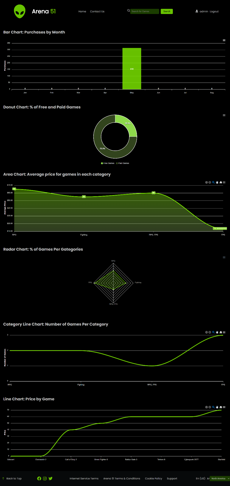
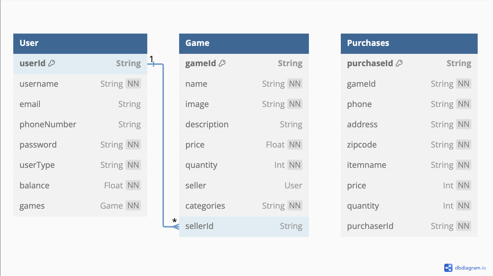
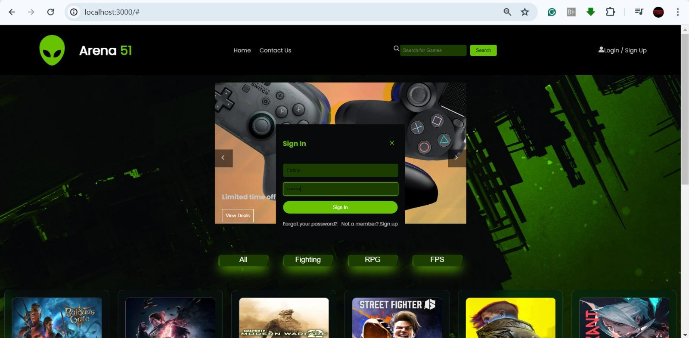
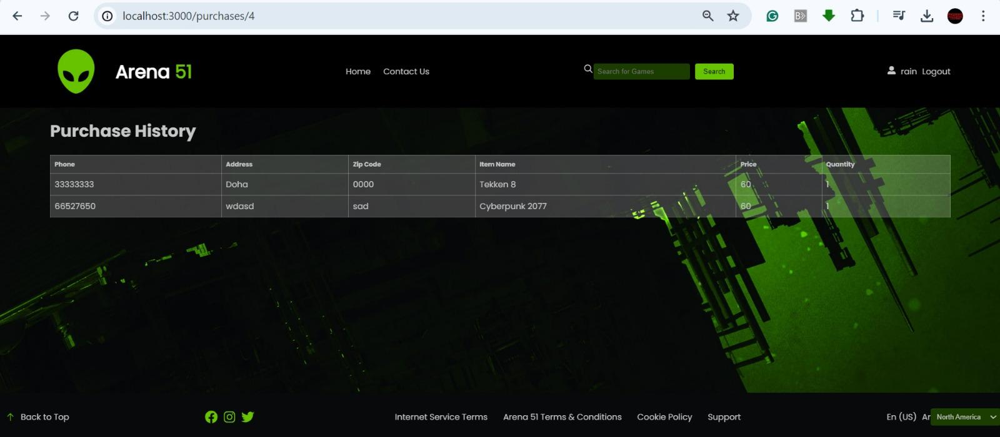
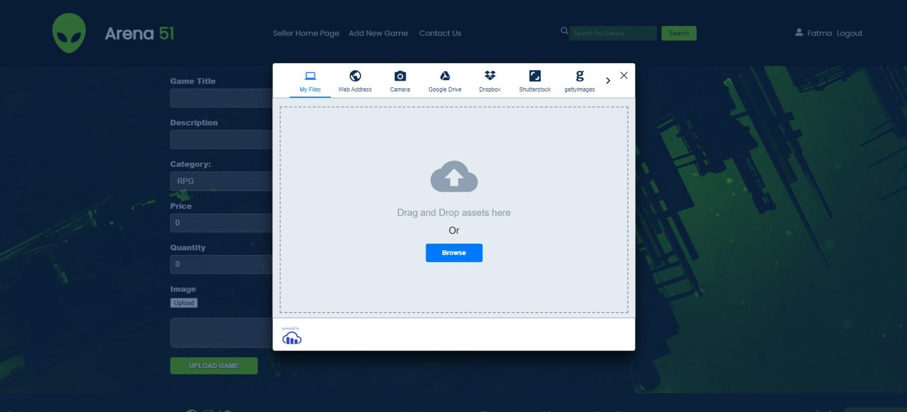

# 🎮 Arena 51 - Gaming E-commerce Website  
<p align="center">
   
</p>

A full-stack gaming e-commerce platform built as a university project for **Web Project - Phase 2**.  
The platform supports **Customers, Sellers, and Admins**, allowing users to buy/sell games and providing rich statistics for admins.  

---

## 📌 Team Members
- **Najlaa Al-Sahel** – 202103401  
- **Islam Hamdi** – 202004552  
- **Rain Al-Kai** – 202005090  

**Instructor:** Dr. Mucahid Kutlu  
**Submission Date:** 11-05-2024  

---

## 🚀 Features  

### 👤 Customer  
- Register/Login to the system.  
- Browse available games.  
- Purchase games listed by sellers.  
- View purchase history.  

### 🛒 Seller  
- Add new games to the platform.  
- View and manage listed games.  
- Games become immediately visible to customers.  

### 🛠 Admin  
- Access advanced **statistics dashboards** built with Next.js and React.  
- Monitor website activity: purchases, categories, pricing trends.  
- Export graphs as **SVG, PNG, CSV**.  
- Interactive charts with zoom in/out for detailed insights.  

---

## 📊 Admin Statistics Dashboard  

     

📎 *All charts support export (SVG, PNG, CSV) and zooming for clarity.*  

---

## 🗄️ Data Model  

The project uses a **Prisma schema** for database modeling.  

Main entities:  
- **User** (`userId, username, email, phoneNumber, password, balance`)  
- **Game** (`gameId, sellerId, title, price, categories`)  
- **Purchases** (`purchaseId, purchaserId, gameId, date`)  

📷 Data Model Diagram:  
  

---

## 🛠️ Database Queries (SQL Examples)  

```sql
-- Retrieve all users
SELECT * FROM User;

-- Retrieve a specific user by ID
SELECT * FROM User WHERE userId = 'user_id';

-- Retrieve all games
SELECT * FROM Game;

-- Retrieve a specific game by ID
SELECT * FROM Game WHERE gameId = 'game_id';

-- Retrieve purchases made by a specific user
SELECT * FROM Purchases WHERE purchaserId = 'user_id';

-- Insert a new user
INSERT INTO User (userId, username, email, phoneNumber, password)
VALUES ('user_id', 'username', 'email@example.com', '+123456789', 'password');

-- Update user's balance
UPDATE User SET balance = new_balance WHERE userId = 'user_id';

-- Delete a purchase
DELETE FROM Purchases WHERE purchaseId = 'purchase_id';
```  

---

## ⚙️ Tech Stack  

- **Frontend:** Next.js (React)  
- **Backend:** Node.js / Express  
- **Database ORM:** Prisma  
- **Database:** SQL (seeded with `seed.js`)  
- **Charts/Statistics:** React Chart libraries  

---

## 📷 Screenshots  

### Customer Flow  
- Login and purchase flow  
  

  
  

### Seller Flow  
- Add new game to the platform  
  

---

## 🧪 Testing  

- All functionalities tested: Customer purchase flow, Seller adding games, Admin statistics.  
- Database queries verified with live data.  
- Statistics updated dynamically as more games and purchases were added.  

---

## 👥 Contributions  

- **Islam Hamdi**: UI design, Database model, queries, backend API integration.  
- **Rain Al-Kai**: Seller functionality, statistics dashboard, documentation. 
- **Najlaa Al-Sahel**: customer features, testing.  

---

## 📜 License  
This project was developed for educational purposes as part of **Web Project Phase 2 at Qatar University**.  
